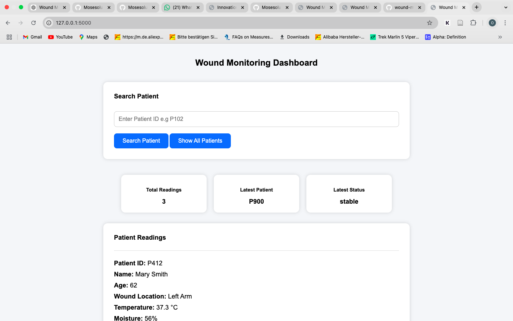
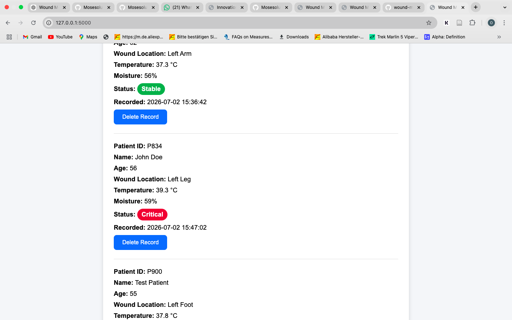
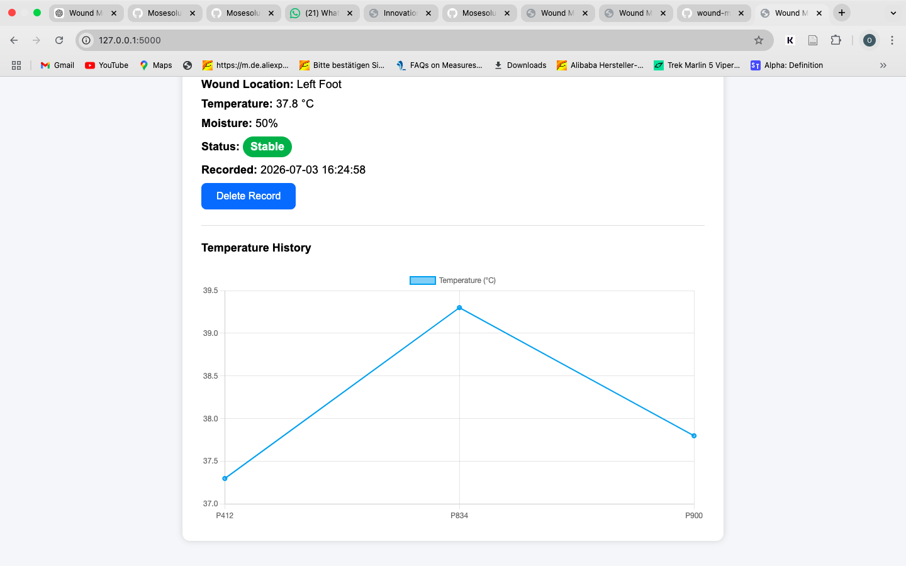

# Wound Monitoring System


## Run in GitHub Codespaces

Open this repository using GitHub Codespaces.

Launch the Wound Monitoring System with one command:

```bash
cd backend && pip install -r requirements.txt && python app.py
```

After the server starts, open the forwarded port 5000 URL provided by GitHub Codespaces.

The application dashboard will open in the browser.


## Project Description

The Wound Monitoring System is an interactive healthcare monitoring application designed to visualize wound sensor data.

The system collects patient wound information such as temperature, moisture level, wound location, and healing status.

Healthcare providers can register patients, monitor wound conditions, search patient records, remove outdated records, and view sensor data through an interactive dashboard.

The application also supports healthcare data exchange concepts using FHIR-style JSON formatting for wound sensor observations.


## Features

- Patient registration system
- Real-time wound monitoring dashboard
- Temperature tracking
- Moisture monitoring
- Patient search functionality
- Delete patient records
- Automatic dashboard updates
- Healthcare FHIR JSON data format support
- Chart.js temperature history visualization
- Interactive D3.js sensor visualization
- Status classification:
  - Stable
  - Warning
  - Critical


## Technologies Used


### Backend

- Python
- Flask
- Flask SQLAlchemy
- SQLite Database
- REST API
- FHIR JSON Structure


### Frontend

- HTML
- CSS
- JavaScript
- Chart.js
- D3.js


## System Architecture


Sensor Data Collection

↓

Flask Backend API

↓

SQLite Database

↓

FHIR JSON API Response

↓

REST API Communication

↓

Frontend Dashboard

↓

Chart.js and D3.js Visualization


## Database Information

The database stores:

- Patient ID
- Patient Name
- Patient Age
- Wound Location
- Temperature Reading
- Moisture Level
- Wound Status
- Date and Time Created


## API Endpoints


### Home Dashboard

GET

/


### View Sensor Data

GET

/sensor-data


### Healthcare FHIR Sensor Data

GET

/fhir-data


### Add Sensor Reading

POST

/sensor-data


### Register Patient

GET / POST

/register


### Delete Patient Record

DELETE

/delete/<id>


## Project Screenshots


### Wound Monitoring Dashboard




### Patient Search and Records




### Temperature Visualization




## Data Visualization

The system includes two visualization approaches:


### Chart.js

Displays wound temperature history using a line graph.


### D3.js

Provides an interactive visualization of wound sensor measurements generated from live JSON healthcare data.


## Local Installation


Clone the repository:

```bash
git clone https://github.com/Mosesoluwaseye/wound-monitoring-system.git
```


Move into the project folder:

```bash
cd wound-monitoring-system
```


Run the application:

```bash
cd backend && pip install -r requirements.txt && python app.py
```


Open:

```text
http://127.0.0.1:5000
```


## Project Structure


wound-monitoring-system

│

├── backend

│   ├── app.py

│   ├── database.py

│   ├── models.py

│   ├── static

│   └── templates

│

├── database

├── diagrams

├── docs

├── frontend

└── README.md


## Future Improvements

- Connect physical IoT temperature sensors
- Connect moisture detection sensors
- Add user authentication system
- Add cloud database storage
- Deploy the application online
- Add mobile application support
- Add advanced wound healing predictions
- Add healthcare system integration


## Project Purpose

This project demonstrates how digital health technologies can support wound monitoring using sensor data collection, database management, healthcare data formatting, and real-time visualization.

The system shows how healthcare providers can track wound conditions, analyze sensor measurements, and identify possible complications through digital monitoring.