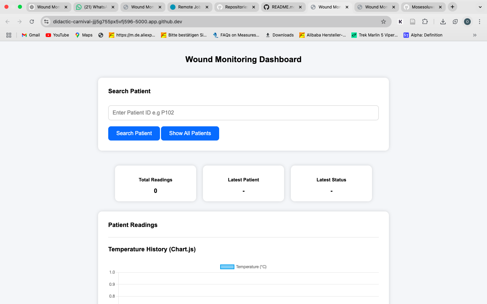
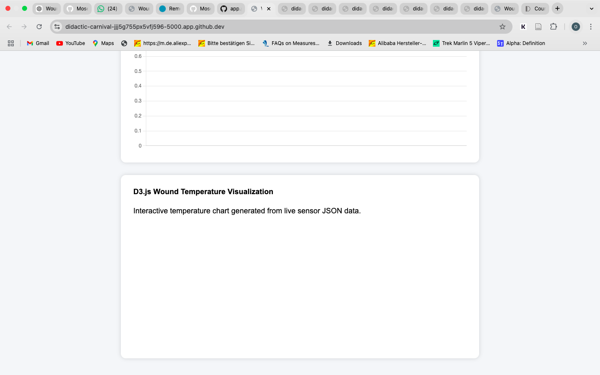

# Wound Monitoring System


## Run in GitHub Codespaces

Repository:

https://github.com/Mosesoluwaseye/wound-monitoring-system


Open this repository using GitHub Codespaces.

Launch the Wound Monitoring System with one command:

```bash
docker compose up --build
```

Docker will automatically:

- Build the application environment
- Install all required dependencies
- Start the Flask backend server
- Launch the Wound Monitoring System


After the server starts:

1. Open the PORTS tab in GitHub Codespaces.
2. Select port 5000.
3. Set visibility to Public if required.
4. Open the forwarded GitHub Codespaces URL.

Current Codespaces application URL:

```text
https://didactic-carnival-jjj5g755px5vfj596-5000.app.github.dev/
```

The Wound Monitoring Dashboard will open in the browser.


## Project Description

The Wound Monitoring System is an interactive healthcare monitoring application designed to collect, manage, and visualize wound sensor information.

The system records:

- Patient information
- Temperature readings
- Moisture levels
- Wound location
- Healing status


Healthcare providers can register patients, monitor wound conditions, search records, remove outdated information, and analyze wound sensor data through a dashboard.

The application includes healthcare data exchange concepts using FHIR-style JSON observation formatting.


## Features

- Patient registration system
- Wound monitoring dashboard
- Temperature monitoring
- Moisture monitoring
- Patient search functionality
- Delete patient records
- Automatic dashboard updates
- REST API communication
- Healthcare FHIR JSON format support
- Chart.js data visualization
- D3.js interactive visualization
- Automated backend testing
- Docker container support
- GitHub Codespaces deployment


## Technologies Used


### Backend

- Python
- Flask
- Flask SQLAlchemy
- SQLite Database
- REST API
- FHIR JSON Structure


### Frontend

- HTML
- CSS
- JavaScript
- Chart.js
- D3.js


### Testing and Deployment

- Pytest
- Docker
- Docker Compose
- Git
- GitHub Codespaces
- VS Code


## Project Screenshots


### Wound Monitoring Dashboard




### Chart.js Temperature Monitoring and D3.js Visualization




### Docker Backend Running Successfully


## Data Visualization


### Chart.js

Displays wound temperature history using interactive charts.


### D3.js

Creates dynamic visualization using live wound sensor JSON data.


## API Endpoints


### Dashboard

```text
GET /
```


### Sensor Data API

```text
GET /sensor-data
```


### FHIR Healthcare Data

```text
GET /fhir-data
```


### Add Sensor Reading

```text
POST /sensor-data
```


### Patient Registration

```text
GET /register

POST /register
```


### Delete Patient Record

```text
DELETE /delete/<id>
```


## Local Installation


Clone repository:

```bash
git clone https://github.com/Mosesoluwaseye/wound-monitoring-system.git
```


Open project:

```bash
cd wound-monitoring-system
```


Start application:

```bash
docker compose up --build
```


Open:

```text
http://localhost:5000
```


## Automated Testing

Run:

```bash
pytest -v
```


Successful test result:

```text
3 passed
```


Current tests:

- Home dashboard route test
- Sensor data API test
- FHIR healthcare API test


## Project Structure

```text
wound-monitoring-system

├── backend
│   ├── app.py
│   ├── database.py
│   ├── models.py
│   ├── static
│   └── templates

├── frontend

├── database

├── diagrams

├── docs

├── hardware

├── sensor-data

├── tests
│   └── test_app.py

├── Dockerfile

├── docker-compose.yml

├── dashboard-preview.png

├── visualization-preview.png

├── backend-running.png

├── README.md

└── LICENSE
```


## Development Checklist Completed

- Working Flask application
- Database integration
- REST API implementation
- FHIR-style healthcare JSON response
- Frontend dashboard
- Sensor data visualization
- Chart.js implementation
- D3.js implementation
- Automated Pytest testing
- Docker containerization
- Docker Compose one-command startup
- Git version control
- GitHub repository
- GitHub Codespaces support
- Project documentation


## Future Improvements

- Connect physical IoT temperature sensors
- Connect moisture detection sensors
- Add user authentication system
- Add cloud database storage
- Deploy application online
- Add mobile application support
- Add advanced wound healing predictions
- Add healthcare system integration


## Project Purpose

This project demonstrates how digital health technologies can support wound monitoring through sensor data collection, database management, healthcare data formatting, and real-time visualization.

The system shows how healthcare providers can track wound conditions, analyze sensor measurements, and identify possible complications using digital monitoring technology.